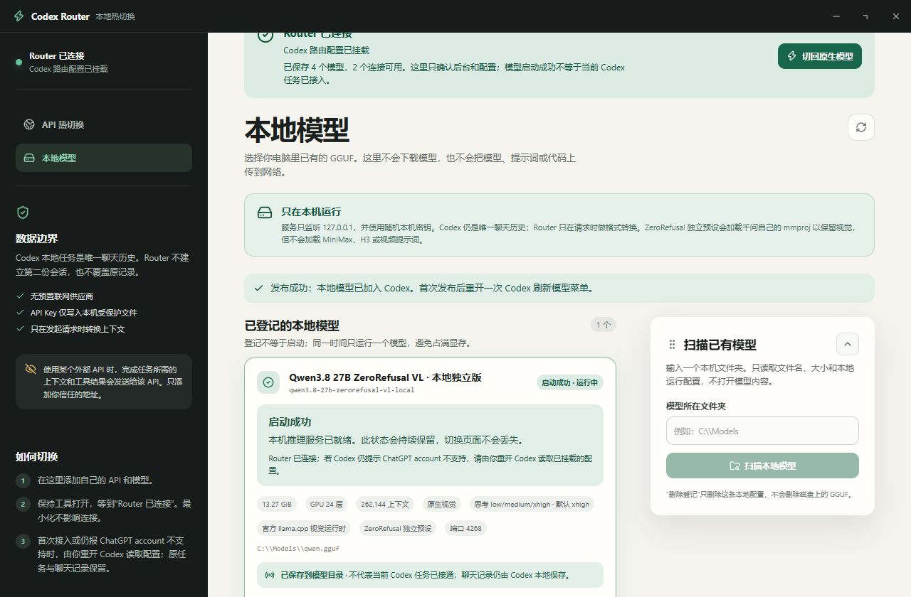

# Codex Router Local

一个面向 Codex App / CLI 的本地模型与 API 热切换外壳。

它不重写 Codex，也不接管 Codex 的聊天记录。Codex 本地任务历史仍是唯一的 canonical history；Router 只在请求发出时完成上游协议、上下文和工具调用格式转换。因此切换 API、模型或切回原生 GPT 后，仍可在同一个 Codex 任务中继续工作。

> 本项目不包含模型文件、API Key、供应商账号或预置联网服务。所有连接都由使用者自己添加和启用。



## 能做什么

- 添加自己的 OpenAI Responses API 或 Chat Completions 兼容连接
- 检测连接、读取供应商公开的模型列表，也可手动填写精确模型 ID
- 在 Codex 模型菜单中切换模型，不修改或覆盖 Codex 原始会话历史
- 对 429、5xx、连接失败等“尚未返回正文”的请求按顺序 fallback
- 设置可选的项目启动默认模型；不会锁定任务，进入任务后仍可继续切换
- 扫描并运行用户自己已有的 GGUF / mmproj 本地模型
- 本地模型保留视觉能力和思考强度参数（实际能力取决于模型与 llama.cpp）
- 提供健康检查、连接状态、启动进度与持久状态提示
- 保留原版 Codex 的 agent、shell、patch、MCP 和 subagents 等能力

## 数据边界

- 聊天记录：由 Codex 保存，Router 不建立第二份 canonical history。
- API Key：写入本机受保护的凭据文件，不写入模型目录、命令行参数或日志。
- 外部 API：只有在你主动添加并连接后，当前请求所需的上下文与工具结果才会发往该地址。
- 本地模型：推理服务只监听 `127.0.0.1`，模型文件不会被上传。
- 原生模式：控制中心未连接中转时，Codex 使用自己的原生配置与模型目录。

使用外部 API 就意味着该供应商可以看到你发给它的请求内容。请只添加你信任的地址，并遵守供应商条款。

## 环境要求

- Codex App 或 Codex CLI
- Node.js 22.19+
- Git
- `uv`，或 Python 3.10+ 且支持 `venv`
- Windows 10/11、macOS 或 Linux（桌面控制中心以 Windows 为主要验证环境）

## 安装

### Windows

```powershell
git clone https://github.com/YIFANGTXX/codex-router-local.git
Set-Location codex-router-local
powershell.exe -NoProfile -ExecutionPolicy Bypass -File .\install.ps1 -Target codex -Guided
```

### macOS / Linux

```sh
git clone https://github.com/YIFANGTXX/codex-router-local.git
cd codex-router-local
./install.sh --target codex --guided
```

安装器会先检查依赖并创建回滚快照，不会静默安装系统包。更完整的安装、升级与卸载说明见 [docs/INSTALL.md](docs/INSTALL.md)。

## 使用外部 API

1. 打开 **Codex Router** 控制中心，进入 **API 热切换**。
2. 填写连接名称、本地标识、Base URL、API 格式和 API Key。
3. 点击 **检测连接**。若供应商支持 `/models`，可点击 **读取模型**；否则手动填写模型 ID。
4. 保存后点击 **连接中转模型**。
5. 首次发布模型目录后完整退出并重新打开一次 Codex。之后在 Codex 的模型菜单中切换。

连接名称只是本地显示名；真正调用哪个模型由供应商返回的模型 ID 或你填写的精确模型 ID 决定。

## 使用本地 GGUF 模型

1. 进入 **本地模型**。
2. 扫描你自己的模型文件夹，选择 GGUF；视觉模型可同时指定匹配的 mmproj。
3. 登记模型并启动本地推理服务。
4. 状态显示“启动成功”后，将它发布到 Codex，再从模型菜单选择。

模型权重不会随本项目下载或分发。较大的模型需要足够的内存、显存和上下文空间；首次加载可能较慢。

## 项目默认模型

“项目文件夹”只表示某个工作目录打开时优先选择哪个模型，不会把 Codex 锁死在该任务，也不会复制聊天记录。这个设置是可选的，进入任务后仍可随时从 Codex 模型菜单切换。

## 跨模型上下文连续性

设计原则是：

```text
Codex 本地任务历史（唯一原始记录）
              │
              ▼
       Codex Router Local
       只做请求时的格式转换
              │
       ┌──────┼────────┐
       ▼      ▼        ▼
    原生 GPT  外部 API  本地 GGUF
```

Router 不修改或覆盖 Codex 原始历史。不同供应商对工具调用和上下文窗口的支持并不完全一致，因此 Router 会进行兼容转换与窗口控制；如果目标模型自身能力不足，Codex 会显示供应商返回的错误，而不是伪造成功。

## 开发与验证

```powershell
npm ci
npm test

Set-Location apps/control-center
npm ci
npm test
```

`npm test` 是公开版默认验收套件。要运行包含历史供应商适配和全部跨平台打包场景的上游兼容套件，可使用 `npm run test:full`；其中部分用例需要 POSIX shell、创建符号链接的权限或真实供应商凭据。

常用诊断：

```powershell
.\bin\model-router codex doctor
```

架构说明见 [docs/HOW-IT-WORKS.md](docs/HOW-IT-WORKS.md)，安全边界见 [SECURITY.md](SECURITY.md)。

## 已知限制

- 首次把中转模型发布进 Codex 目录后，通常需要完整重启 Codex 一次。
- 并非所有 Chat Completions 兼容服务都完整支持流式响应、视觉输入或工具调用。
- fallback 只会在还没有向 Codex 返回正文时执行，避免把两个模型的回答拼在一起。
- 本地大模型速度主要受量化、上下文长度、CPU/GPU 卸载层数和硬件带宽影响。

## 许可证与来源

本项目基于 [duolahypercho/codex-router](https://github.com/duolahypercho/codex-router) 的 MIT 许可代码整理，并保留相关第三方归属信息。详见 [LICENSE](LICENSE) 与 [NOTICE.md](NOTICE.md)。

本版本由 [一方通行](https://github.com/YIFANGTXX) 整理、实现并发布。二次开发、修改或再分发时，请在 README、关于页面或其他显著位置明确保留 **一方通行** 的原作者署名，并同时保留上游作者和第三方许可证声明。

这是独立社区项目，与 OpenAI 或任何模型供应商均无隶属或背书关系。
